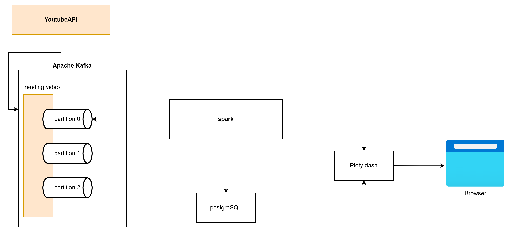

# Youtube Data Analysis

This project is an efficient and intuitive platform that compiles data. It consists of several modules such as `dashboard`, `spark`, and `youtube_api`. The `dashboard` module helps visualize the data in meaningful ways whereas the `spark` module aids in processing the data for efficient analysis. The `youtube_api` module is employed to fetch relevant data from YouTube.

In the project, these modules collaborate to form a robust data analysis platform. It helps users to interpret their YouTube data in a more comprehendible manner. 

## Useful link

Kafka-ui : http://localhost:9021

Spark ui master : http://localhost:8080

dashboard : http://localhost:8050

pgadmin : http://localhost:82

## Actual Architecture 

## Getting Started

These instructions will help you get a copy of the project up and running on your local machine for development and testing purposes.

### Prerequisites

- Docker Desktop && Docker compose
- Python installed

## Configuration

Before running, please make sure to apply necessary configurations and setup relevant access keys for YouTube API.

How to have a YouTube API Key ? 
- Make sure to have a Google Cloud Platform Account
- Use an existing project or create one if you don't have
- Enable the YouTube Data API v3 if not
- Create API Credentials

How to add it in the project ?
- Create a file in the root project name "./youtube_api/secret.txt" of you can change it in the docker compose if u want
- Add your key in it. 

that's it :)

